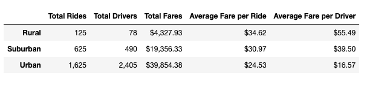
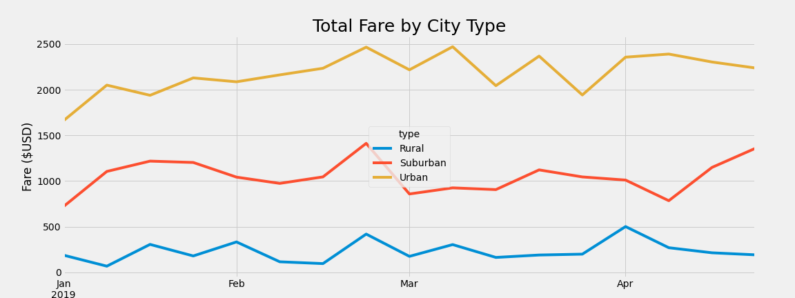

# PyBer_Analysis

## Overview of the analysis
PyBer, a ride-sharing app company operating in three types of cities: urban, suburban, and rural. 
First, we analyzed the ride count, average fare per ride, and average number of drivers depending on the type of city. Also we compared each city's metrics and the average ride fare to the total number of rides per city. 
Now we need to create a data frame that organized total rides, total drivers, total fares, average fare per ride, and average fare per driver and finally create a multiple-line chart, describe the differences in ride-sharing data among the different city types.

## Results
### Summary DataFrame

The Urban city type has the largest number of drivers and rides, although the average fare per ride and per driver is the lowest. 

The Rural city type, on the contrary, has a minimum number of drivers and rides while the average fare per ride and per driver is the highest.

This situation looks quite logical as it reflects the fundamentals of economic theory. 

In the big cities, there are significantly more drivers than rides and it keeps the fare per ride and fare per driver quite low. 

In the rural cities the number of drivers less than the total number of rides, therefore, the demand for drivers is high which allows fares to be high.

### Total Fare by City Type Chart

The multiple line chart displaying total fares for urban, suburban, and rural city types for each week between January 1, 2019 and April 29, 2019.

As we can see on the chart, seasons dependency is not very typical for these charts. 

All the charts follow the same trend throughout the months. We can highlight the end of February as a weekly expressed maximum for all three charts.

Also, the multiple line chart clearly demonstrates that the urban cities have the highest fare rate, then follow suburban cities and the rural cities have the lowest rate through all months.

## Summary 

1. The company needs to increase the number of rides in Urban cities. The total fare for Urban cities is highest while the drivers can experience a lack of work.  An advertising campaign can be considered as a good way to influence the number of rides. The company could launch an advertising campaign at the end of February when the total fare rate is increasing.

2. Probably the company should redirect some of the drivers from Urban to other types of cities such as Suburban and Rural.

3. The company should think about decreasing the fare per ride for Rural and Suburban cities. This would help to increase the number of rides for these types of cities.
